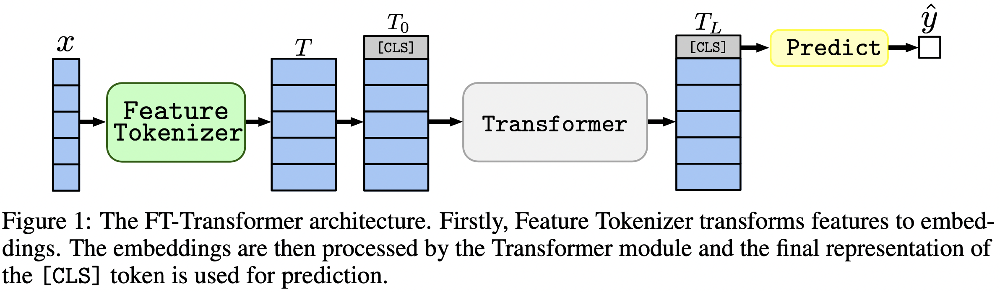

# Revisiting Deep Learning Models for Tabular Data (NeurIPS 2021)

> [!IMPORTANT]
> Check out the new tabular DL model: [TabM](https://github.com/yandex-research/tabm)

:scroll: [arXiv](https://arxiv.org/abs/2106.11959)
&nbsp; :package: **[Python package](./package/README.md)**
&nbsp; :books: [Other tabular DL projects](https://github.com/yandex-research/rtdl)

This is the official implementation of the paper
"Revisiting Deep Learning Models for Tabular Data".

# TL;DR

*In one sentence: MLP-like models are still good baselines, and FT-Transformer
is a new powerful adaptation of the Transformer architecture for tabular data problems.*



The paper focuses on architectures for tabular data problems. The results:

- A simple tuned **MLP** is still a good baseline: it performs on par with or even better
  than most of sophisticated architectures.
- **ResNet** (an MLP-like model with skip connections and batch normalizations) further
  highlights this point: MLP-like models are good baselines for tabular deep learning,
  and prior work does not outperform them.
- **FT-Transformer** is a new architecture which changes this status quo:
    - on benchmarks, it demonstrated the best average performance among deep models
        (including the aforementioned MLP-like baselines);
    - on the datasets where GBDT (gradient-booosted decision trees) dominates over
        DL models, FT-Transformer reduces (not completely) the gap between GBDT and DL.
    - FT-Transformer is slower than MLP-like models

# Python package

The [Python package](./package/README.md) in the `package/` directory
is the recommended way to use the paper in practice and for future work.

---

**The rest of the document**:
- [Metrics & Hyperparameters](#how-to-explore-metrics-and-hyperparameters)
- [How to reproduce the reported results](#how-to-reproduce-the-results)
- [How to cite](#how-to-cite)

---

# How to explore metrics and hyperparameters

The `output/` directory contains numerious results and (tuned) hyperparameters
for various models and datasets used in the paper.

## Metrics

For example, let's explore the metrics for the MLP model.
First, let's load the reports (the `stats.json` files):

```python
import json
from pathlib import Path

import pandas as pd

df = pd.json_normalize([
    json.loads(x.read_text())
    for x in Path('output').glob('*/mlp/tuned/*/stats.json')
])
```

Now, for each dataset, let's compute the test score averaged over all random seeds:

```python
print(df.groupby('dataset')['metrics.test.score'].mean().round(3))
```

*The output exactly matches Table 2 from the paper:*

```
dataset
adult                 0.852
aloi                  0.954
california_housing   -0.499
covtype               0.962
epsilon               0.898
helena                0.383
higgs_small           0.723
jannis                0.719
microsoft            -0.747
yahoo                -0.757
year                 -8.853
Name: metrics.test.score, dtype: float64
```

## Hyperparameters

The above approach can also be used to explore hyperparameters to get intuition
on typical hyperparameter values for different algorithms.
For example, this is how one can compute the median tuned learning rate
for the MLP model:

> [!NOTE]
> For some algorithms (e.g. MLP), more recent projects offer more results
> that can be explored in a similar way. For example, see
> [this paper on TabR](https://github.com/yandex-research/tabular-dl-tabr/).

> [!WARNING]
> **Use this approach with caution.** When studying hyperparameter values:
> 1. Beware of outliers.
> 2. Take a look at raw unaggregated values to get intuition on typical values.
> 3. For a high-level overview, plot the distribution and/or compute multiple quantiles.

```python
print(df[df['config.seed'] == 0]['config.training.lr'].quantile(0.5))
# Output: 0.0002161505605899536
```

# How to reproduce the results

> [!NOTE]
>
> This section is long.
> **Use the "Outline" feature** on GitHub on in your text editor
> to get an overview of this section.

## Code overview

The code is organized as follows:
- `bin`:
  - training code for all the models
  - `ensemble.py` performs ensembling
  - `tune.py` performs hyperparameter tuning
  - code for the section "When FT-Transformer is better than ResNet?" of the paper:
    - `analysis_gbdt_vs_nn.py` runs the experiments
    - `create_synthetic_data_plots.py` builds plots
- `lib` contains common tools used by programs in `bin`
- `output` contains configuration files (inputs for programs in `bin`) and results (metrics, tuned configurations, etc.)
- `package` contains the Python package for this paper

## Setup the environment

### PyTorch environment
Install [conda](https://docs.conda.io/en/latest/miniconda.html)

```bash
export PROJECT_DIR=<ABSOLUTE path to the repository root>
# example: export PROJECT_DIR=/home/myusername/repositories/revisiting-models
git clone https://github.com/yandex-research/tabular-dl-revisiting-models $PROJECT_DIR
cd $PROJECT_DIR

conda create -n revisiting-models python=3.8.8
conda activate revisiting-models

conda install pytorch==1.7.1 torchvision==0.8.2 cudatoolkit=10.1.243 numpy=1.19.2 -c pytorch -y
conda install cudnn=7.6.5 -c anaconda -y
pip install -r requirements.txt
conda install nodejs -y
jupyter labextension install @jupyter-widgets/jupyterlab-manager

# if the following commands do not succeed, update conda
conda env config vars set PYTHONPATH=${PYTHONPATH}:${PROJECT_DIR}
conda env config vars set PROJECT_DIR=${PROJECT_DIR}
conda env config vars set LD_LIBRARY_PATH=${CONDA_PREFIX}/lib:${LD_LIBRARY_PATH}
conda env config vars set CUDA_HOME=${CONDA_PREFIX}
conda env config vars set CUDA_ROOT=${CONDA_PREFIX}

conda deactivate
conda activate revisiting-models
```

### TensorFlow environment
_This environment is needed only for experimenting with TabNet. For all other cases use the PyTorch environment._

The instructions are the same as for the PyTorch environment (including installation of PyTorch!), but:
- `python=3.7.10`
- `cudatoolkit=10.0`
- _right before_ `pip install -r requirements.txt` do the following:
  - `pip install tensorflow-gpu==1.14`
  - comment out `tensorboard` in `requirements.txt`

### Data
**LICENSE**: _by downloading our dataset you accept licenses of all its components. We
do not impose any new restrictions in addition to those licenses. You can find the list
of sources in the section "References" of our paper._
1. Download the data: `wget https://www.dropbox.com/s/o53umyg6mn3zhxy/data.tar.gz?dl=1 -O revisiting_models_data.tar.gz`
2. Move the archive to the root of the repository: `mv revisiting_models_data.tar.gz $PROJECT_DIR`
3. Go to the root of the repository: `cd $PROJECT_DIR`
4. Unpack the archive: `tar -xvf revisiting_models_data.tar.gz`

## Tutorial
*This section only provides specific commands with few comments. After completing the tutorial, we recommend checking the next section for better understanding of how to work with the repository. It will also help to better understand the tutorial.*

In this tutorial, we will reproduce the results for MLP on the California Housing dataset. We will cover:
- tuning
- evaluation
- ensembling
- comparing models with each other

Note that the chances to get **exactly** the same results are rather low, however, they should not differ much from ours. Before running anything, go to the root of the repository and explicitly set `CUDA_VISIBLE_DEVICES` (if you plan to use GPU):
```bash
cd $PROJECT_DIR
export CUDA_VISIBLE_DEVICES=0
```

### Check the environment
Before we start, let's check that the environment is configured successfully. The following
commands should train one MLP on the California Housing dataset:
```bash
mkdir draft
cp output/california_housing/mlp/tuned/0.toml draft/check_environment.toml
python bin/mlp.py draft/check_environment.toml
```
The result should be in the directory `draft/check_environment`. For now, the content of the result is not important.

### Tuning
Our config for tuning MLP on the California Housing dataset is located at `output/california_housing/mlp/tuning/0.toml`.
In order to reproduce the tuning, copy our config and run your tuning:
```bash
# you can choose any other name instead of "reproduced.toml"; it is better to keep this
# name while completing the tutorial
cp output/california_housing/mlp/tuning/0.toml output/california_housing/mlp/tuning/reproduced.toml
# let's reduce the number of tuning iterations to make tuning fast (and ineffective)
python -c "
from pathlib import Path
p = Path('output/california_housing/mlp/tuning/reproduced.toml')
p.write_text(p.read_text().replace('n_trials = 100', 'n_trials = 5'))
"
python bin/tune.py output/california_housing/mlp/tuning/reproduced.toml
```
The result of your tuning will be located at `output/california_housing/mlp/tuning/reproduced`, you can compare it with ours: `output/california_housing/mlp/tuning/0`. The file `best.toml` contains the best configuration that we will evaluate in the next section.

### Evaluation
Now we have to evaluate the tuned configuration with 15 different random seeds.

```bash
# create a directory for evaluation
mkdir -p output/california_housing/mlp/tuned_reproduced

# clone the best config from the tuning stage with 15 different random seeds
python -c "
for seed in range(15):
    open(f'output/california_housing/mlp/tuned_reproduced/{seed}.toml', 'w').write(
        open('output/california_housing/mlp/tuning/reproduced/best.toml').read().replace('seed = 0', f'seed = {seed}')
    )
"

# train MLP with all 15 configs
for seed in {0..14}
do
    python bin/mlp.py output/california_housing/mlp/tuned_reproduced/${seed}.toml
done
```

Our directory with evaluation results is located right next to yours, namely, at `output/california_housing/mlp/tuned`.

### Ensembling
```bash
# just run this single command
python bin/ensemble.py mlp output/california_housing/mlp/tuned_reproduced
```
Your results will be located at `output/california_housing/mlp/tuned_reproduced_ensemble`, you can compare it with ours: `output/california_housing/mlp/tuned_ensemble`.

### "Visualize" results

Use the approach described [here](#🔥-how-to-explore-metrics-and-hyperparameters)
to summarize the results of the conducted experiment
(modify the path filter in `.glob(...)` accordingly: `tuned` -> `tuned_reproduced`).

### What about other models and datasets?
Similar steps can be performed for all models and datasets. The tuning process is
slightly different in the case of grid search: you have to run all desired
configurations and manually choose the best one **based on the validation performance**.
For example, see `output/epsilon/ft_transformer`.

## How to work with the repository

### How to run scripts
You should run Python scripts from the root of the repository. Most programs expect a
configuration file as the only argument. The output will be a directory with the same
name as the config, but without the extention. Configs are written in
[TOML](https://toml.io). The lists of possible arguments for the programs are not
provided and should be inferred from scripts (usually, the config is represented with
the `args` variable in scripts). If you want to use CUDA, you must explicitly set the
`CUDA_VISIBLE_DEVICES` environment variable. For example:
```bash
# The result will be at "path/to/my_experiment"
CUDA_VISIBLE_DEVICES=0 python bin/mlp.py path/to/my_experiment.toml

# The following example will run WITHOUT CUDA
python bin/mlp.py path/to/my_experiment.toml
```
If you are going to use CUDA all the time, you can save the environment variable in the
Conda environment:
```bash
conda env config vars set CUDA_VISIBLE_DEVICES="0"
```
The `-f` (`--force`) option will remove the existing results and run the script from scratch:
```bash
python bin/whatever.py path/to/config.toml -f  # rewrites path/to/config
```
`bin/tune.py` supports continuation:
```bash
python bin/tune.py path/to/config.toml --continue
```

### `stats.json` and other results
For all scripts, `stats.json` is the most important part of output. The content varies
from program to program. It can contain:
- metrics
- config that was passed to the program
- hardware info
- execution time
- and other information

Predictions for train, validation and test sets are usually also saved.

### Conclusion
Now, you know everything you need to reproduce all the results and extend
this repository for your needs. The [tutorial](#tutorial) also
should be more clear now. Feel free to open issues and ask questions.

# How to cite
```
@inproceedings{gorishniy2021revisiting,
    title={Revisiting Deep Learning Models for Tabular Data},
    author={Yury Gorishniy and Ivan Rubachev and Valentin Khrulkov and Artem Babenko},
    booktitle={{NeurIPS}},
    year={2021},
}
```
